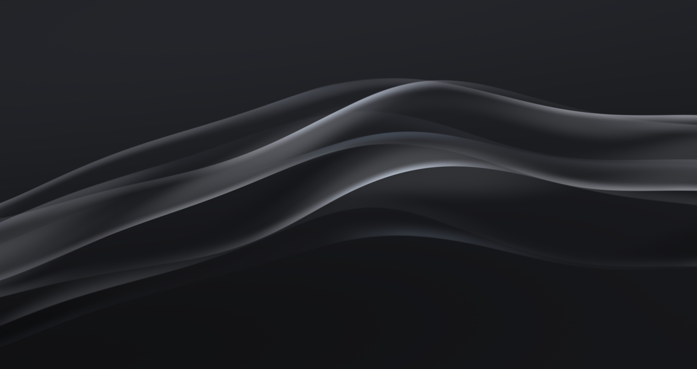
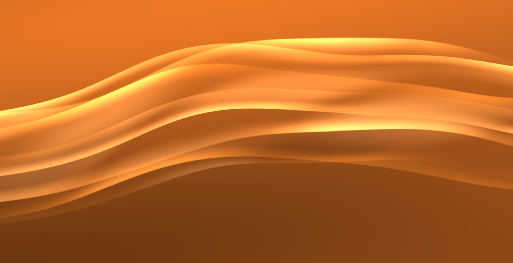

# Waves Wallpaper

A KDE Plasma 6 live wallpaper that creates animated wave effects reminiscent of PlayStation's visual style. It uses a single lightweight GPU shader pass and is suitable for always-on desktop use.

<table>
  <tr>
    <td></td>
    <td></td>
  </tr>
  <tr>
    <td></td>
    <td></td>
  </tr>
</table>

## Features

- Animated wave effects with customizable frequency, amplitude, and speed
- Adjustable framerate for performance tuning
- Preset background themes and adjustable wave brightness
- Smooth animation using a GPU-accelerated shader
- Low GPU overhead: no textures, noise lookups, framebuffers, or extra render passes

## Installation

### Manual Installation

1. Clone or download this repository
2. Navigate to the project directory
3. Run the installation commands:
   ```bash
   just install
   just restart-plasmashell
   ```

### Uninstallation

To uninstall the wallpaper:
```bash
just uninstall
```

## Requirements

- KDE Plasma 6.0 or higher
- OpenGL 2.0 or higher support
- Compatible graphics drivers

## Development

Compiling the shader source requires Qt Shader Tools

```
apt install qt6-shadertools-dev
```

Then compile the shader

```
just compile-shader
```

### Build for the KDE Store

Create the distributable package for upload to the KDE Store:

```bash
just package
```

The package is written to `build/com.github.relvacode.waves.tar.gz`.
